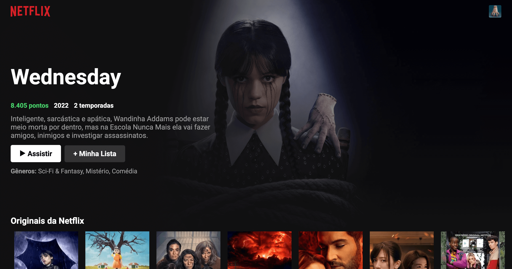

# Clone da Interface da Netflix

## Introdução

Este projeto é um clone da interface principal da Netflix, desenvolvido como parte de um estudo de front-end. A aplicação consome dados da API do [The Movie Database (TMDb)](https://www.themoviedb.org/) para exibir listas de filmes e séries de forma dinâmica.

## Pré-requisitos

Antes de executar este projeto, certifique-se de ter as seguintes dependências instaladas:

- [Node.js](https://nodejs.org/) e [npm](https://www.npmjs.com/) para execução do servidor e gerenciamento de pacotes.

## Como Iniciar

1. Clone esse repositório.
2. Instale as dependencias: `npm install`.
3. Inicie o servidor: `npm start`.
